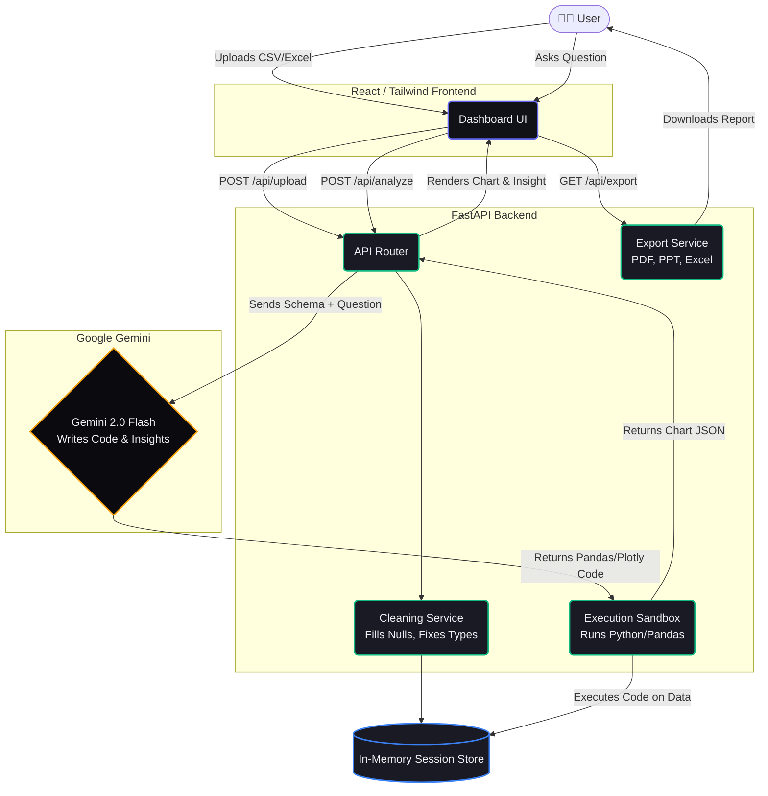

<div align="center">

# 🧠 DataSense
**Agentic Exploratory Data Analysis (EDA) Pipeline**

[](https://reactjs.org/)
[](https://fastapi.tiangolo.com/)
[](https://ai.google.dev/)
[](https://plotly.com/)
[](https://opensource.org/licenses/MIT)

> **Upload your data. Ask your questions. Get analyst-grade insights instantly.**

DataSense is a full-stack, AI-powered Exploratory Data Analysis (EDA) tool that automatically cleans datasets, answers questions using **Google Gemini 2.0 Flash**, generates interactive **Plotly** charts, and exports polished **PDF/PowerPoint/Excel** reports.

[Live Demo](#) • [Features](#-features) • [Installation](#-local-setup) • [Architecture](#-architecture)

</div>

---

## 🚀 Architecture & Flowchart

DataSense operates using an **Agentic AI Pipeline**. The user asks a question, and the LLM acts as an agent, writing Python code to analyze the data. The code is executed in a secure backend sandbox, and the results are rendered beautifully on the frontend.



---

## ✨ Features

| Feature | Description |
|---|---|
| 📁 **Smart Upload** | Drag & drop CSV or Excel files. Instantly previews the first 50 rows. |
| 🧹 **Auto Cleaning** | Automatically fills nulls, removes duplicates, fixes data types, and flags outliers. |
| 🤖 **Agentic Analysis** | Ask up to 10 questions in plain English. The AI writes the code to answer them! |
| 📊 **Interactive Charts** | Bar, line, scatter, pie, heatmap, box — generated using `react-plotly.js`. |
| 💡 **Analyst Insights** | Gemini generates a 3–4 sentence professional narrative explaining the trends in each chart. |
| 📤 **Export Reports** | Download a **PDF Report**, **PowerPoint Slides**, or the **Cleaned Excel File**. |
| 🌑 **Premium UI** | Bloomberg-meets-Vercel dark aesthetic with an animated HTML5 Canvas particle background. |

---

## 🏗️ Tech Stack

### Frontend
- **React 18** + **Vite**
- **Tailwind CSS v4** (Custom Dark Theme Tokens)
- **Plotly.js** (`react-plotly.js`) for interactive charting
- **Axios** + `react-dropzone` + `react-hot-toast`

### Backend
- **FastAPI** (Python)
- **Google Gemini 2.0 Flash API** (`google-genai` SDK)
- **Pandas** + **NumPy** for data manipulation
- **ReportLab** (PDF), **python-pptx** (PPT), **OpenPyXL** (Excel)
- **Kaleido** for server-side chart-to-image conversion

---

## 🚀 Local Setup

### Prerequisites
- Python 3.10+
- Node.js 18+
- A Google Gemini API key ([Get one here](https://aistudio.google.com/app/apikey))

### 1. Clone the repo

```bash
git clone https://github.com/Shivam8292/Agentic-EDA-Pipeline.git
cd "Agentic-EDA-Pipeline"
```

### 2. Backend setup

```bash
cd datasense/backend

# Create and activate virtual environment
python -m venv venv
venv\Scripts\activate      # Windows
# source venv/bin/activate  # macOS/Linux

# Install dependencies
pip install -r requirements.txt

# Configure environment
cp .env.example .env
# Open .env and add your GEMINI_API_KEY

# Start the backend
python main.py
# → Backend runs at http://localhost:8000
```

### 3. Frontend setup

```bash
cd ../frontend

# Install dependencies
npm install

# Start dev server
npm run dev
# → Frontend runs at http://localhost:5173
```

Navigate to [http://localhost:5173](http://localhost:5173) in your browser!

---

## 📖 Example Questions to Try

Upload any sales, HR, or financial dataset and try asking:

1. *"What is the distribution of sales by region?"*
2. *"Show the trend of revenue over time"*
3. *"Which product category has the highest average profit?"*
4. *"What is the correlation between age and salary?"*
5. *"Show the top 10 customers by order value"*

> **Pro Tip:** If you don't know what to ask, just click the **"✨ Suggest Questions"** button and let the AI generate 5 highly relevant questions for you based on your specific dataset schema!

---

## 🔐 Security & Sandbox

- **No Data Leakage:** Only your dataset's *column names* and *3 sample rows* are sent to the Gemini API. The full dataset never leaves your local machine/server.
- **Sandboxed Execution:** The Python code generated by the LLM is executed inside a restricted `exec()` environment where dangerous built-ins (`open`, `import`, `eval`) are blocked.
- **Environment Variables:** API keys are loaded via `.env` and are safely ignored by git.

---

## 📄 License

This project is licensed under the **MIT License** — feel free to use, modify, and distribute it!
